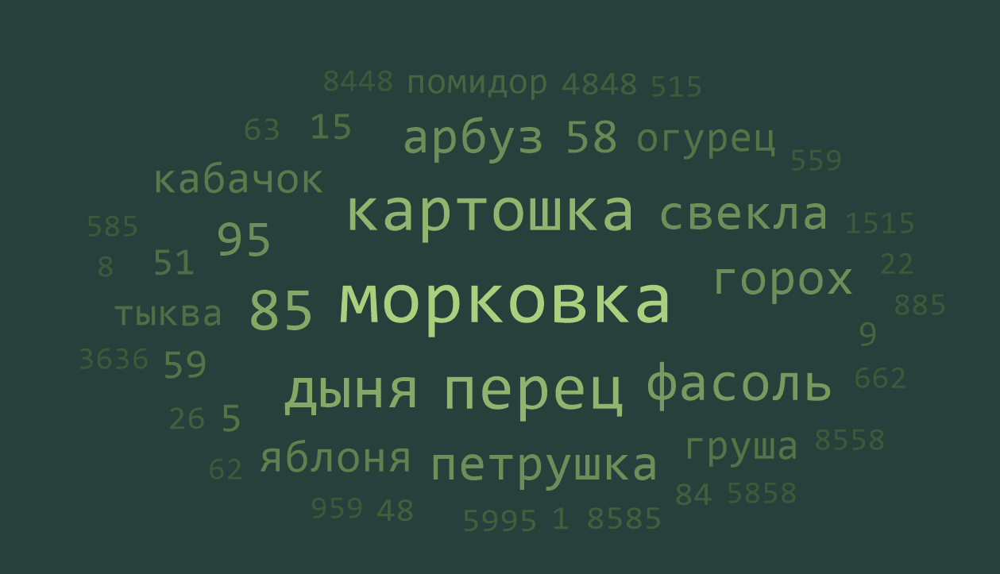
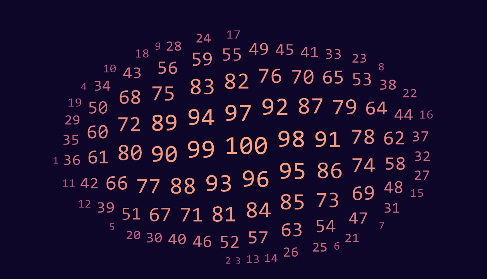

# Облако тегов

## Алгоритм
За основу был взять алгоритм построения облаков на основе спирали:
1. Немного раскручиваем спираль
2. Пытаемся установить прямоугольник
3. Если он не пересекается с нашим облаком _(другими прямоугольниками)_, то все хорошо.
В противном случае возвращаемся к пункту **1**

## Изображения, полученные с помощью генератора облаков

