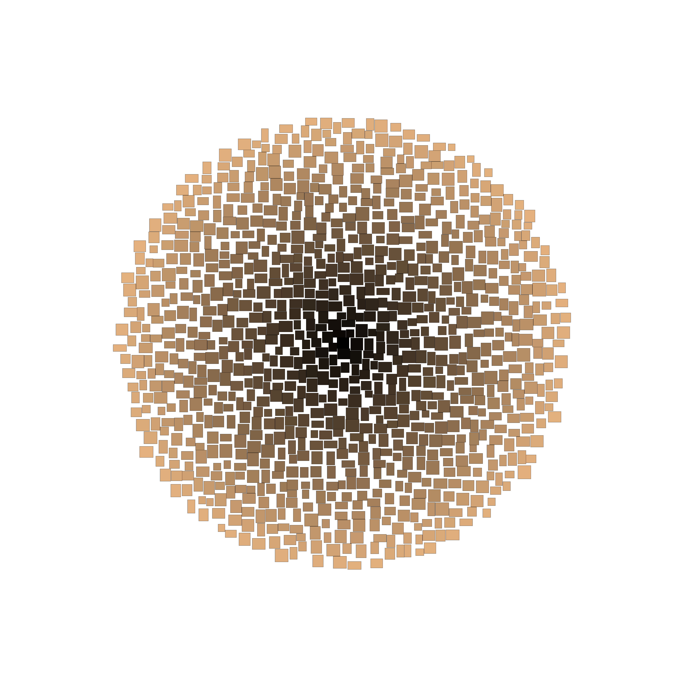

# Test Driven Development

Пройдя блок, ты:

- Узнаешь, почему полезно писать тесты вместе с кодом
- Скорее всего поймешь, что никогда раньше не писал тесты в стиле TDD по-настоящему :-)
- Получишь опыт парного TDD.
- Станешь считать стиль TDD естественным и удобным в работе

## Необходимые знания

Понадобится знание C# или JS

Рекомендуется пройти блок [Тестирование](https://github.com/kontur-courses/testing)

## Самостоятельная подготовка

Посмотри [видеодемонстрацию TDD](https://www.youtube.com/watch?v=lLTv2JSrCBY) (10 минут)

## Очная встреча

~ 3.5 часа

## Закрепление материала

1. Выполни задание [Облако тегов](HomeExercise.md)
2. Спецзадание __TDD__  
Выполни ещё какую-нибудь ближайшую задачу в стиле TDD. Рабочую задачу, если уже работаешь, или учебную, если ещё учишься.

