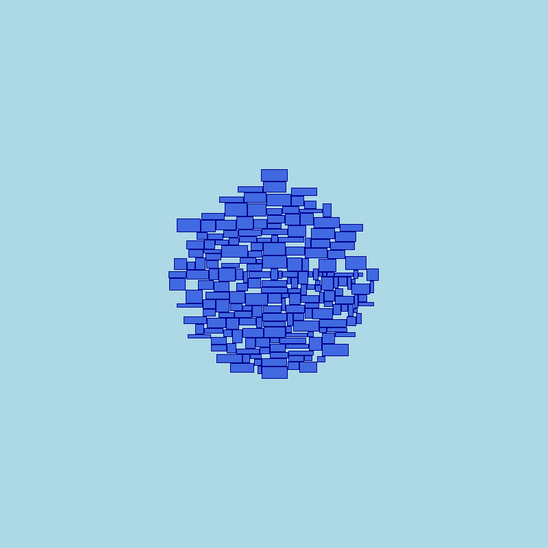
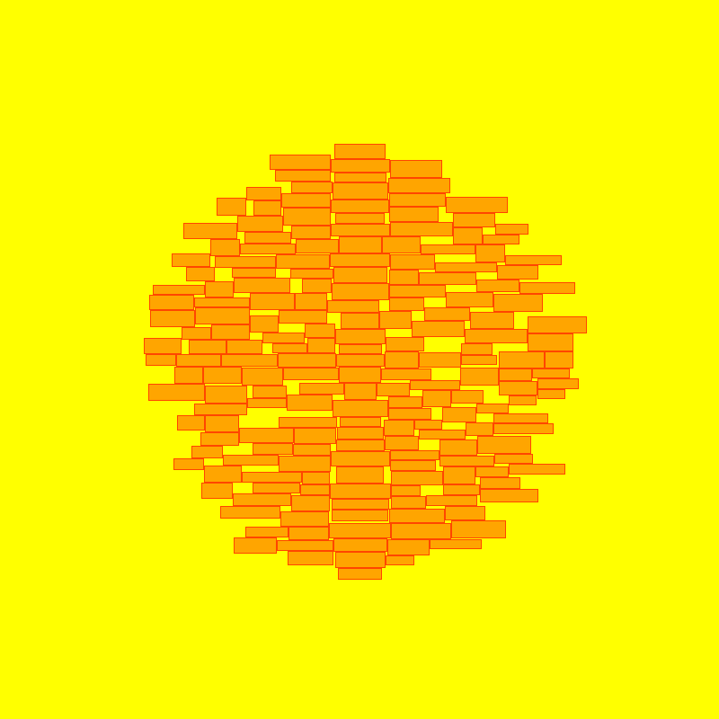
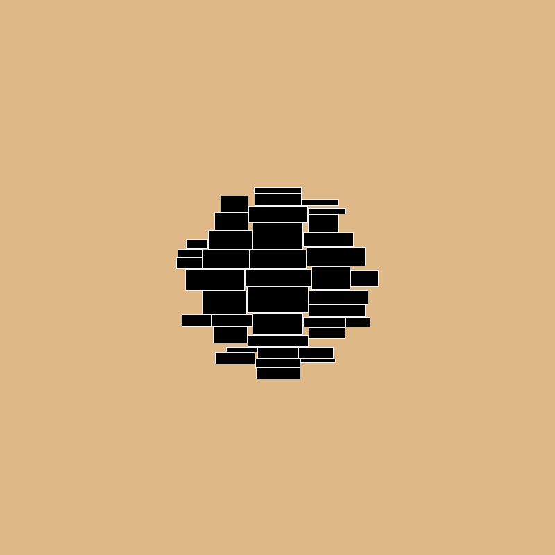

# Примеры вывода

1. Каждый раз добавлялся случайный по размеру прямоугольник

2. Каждый раз добавлялся прямоугоник примерного одинакового размера

3. Каждый раз добавлялся все более маленький прямоугольник, но с погрешностью
