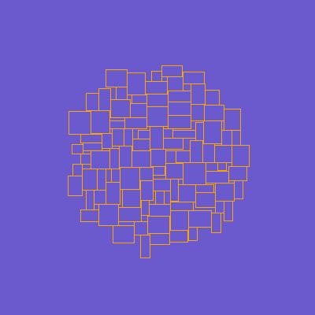
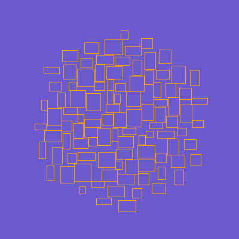

# Words/tags cloud layout

## Algorighm
### Archimedean Spiral

Formula: r = a + b * θ,

a – move start by OX axis, 

b – curve density, 

θ – angle in polar system, 

r – radius in polar system

### How that works
Every time we add a new rectangle.
We run with a fixed step along the Archimedean Spiral and check the points for the possibility of putting this rectangle there(there is no overlap with the already laid out rectangles). We place that rectangle if suitable position is founded.

## Examples

Density: 0.01

AngleStep: 0.01

Density: 1

AngleStep: 1

