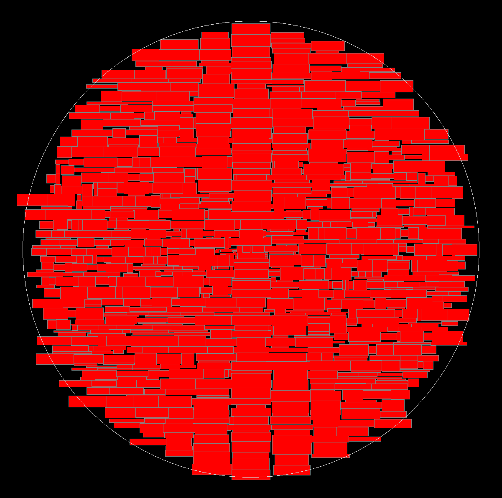
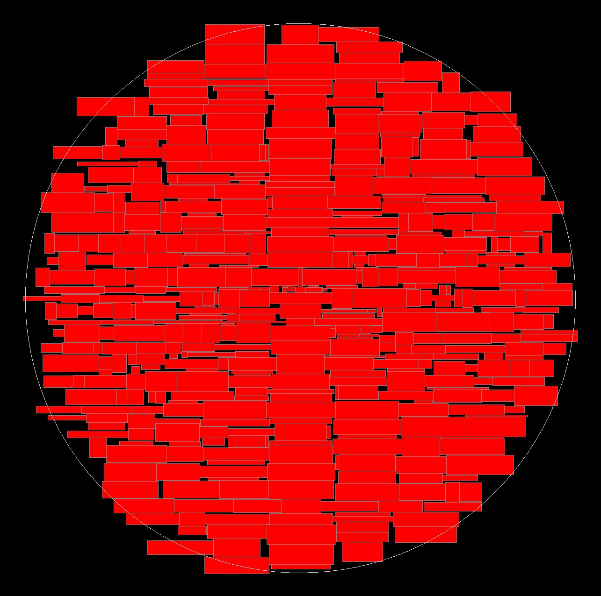
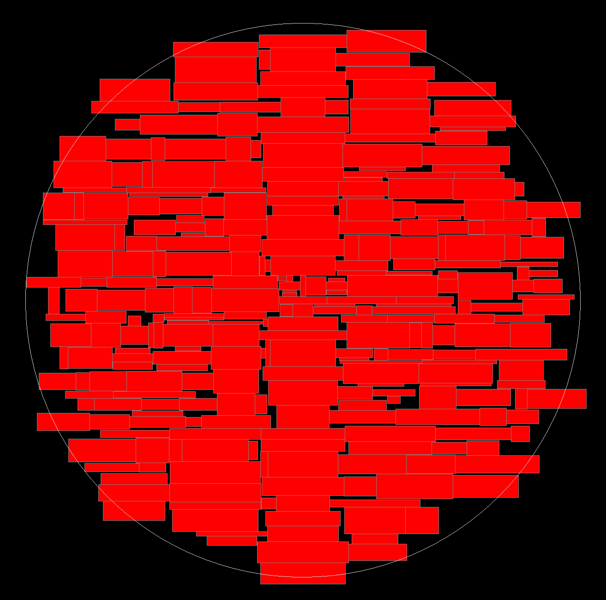

### Случайная раскладка с 1000 прямоугольников и размером 1 ###

---

### Случайная раскладка с 500 прямоугольниками и размером 1.5 ###

---

### Случайная раскладка с 300 прямоугольниками и размером 2 ###

