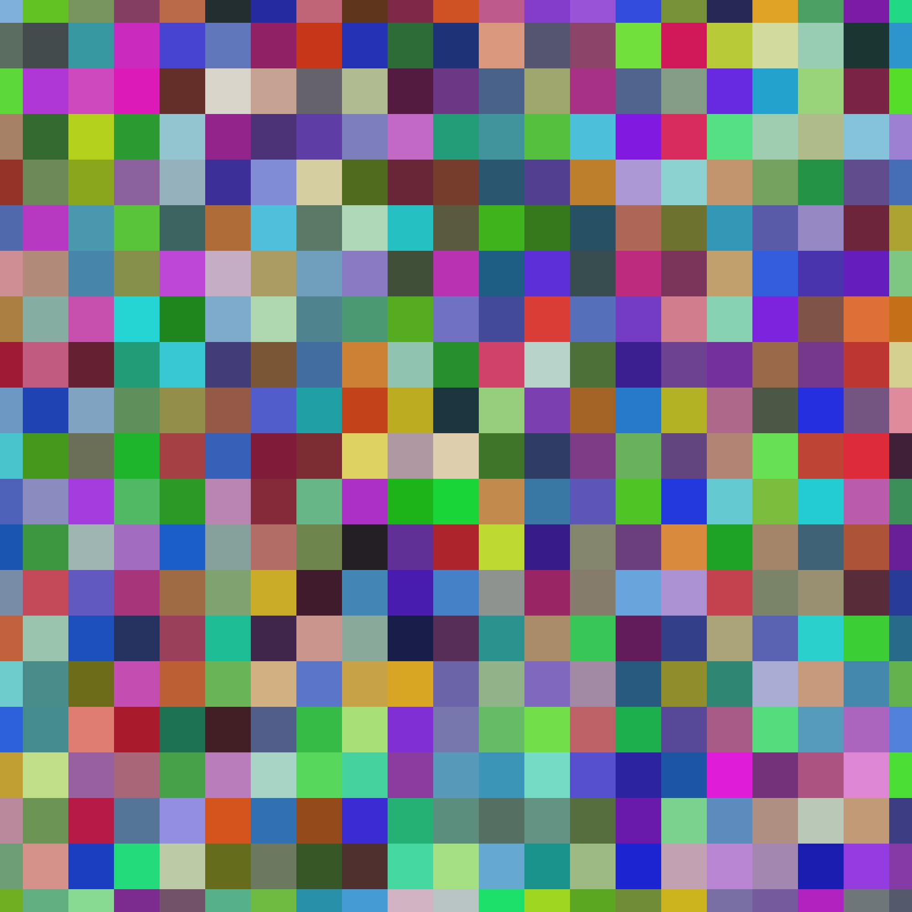
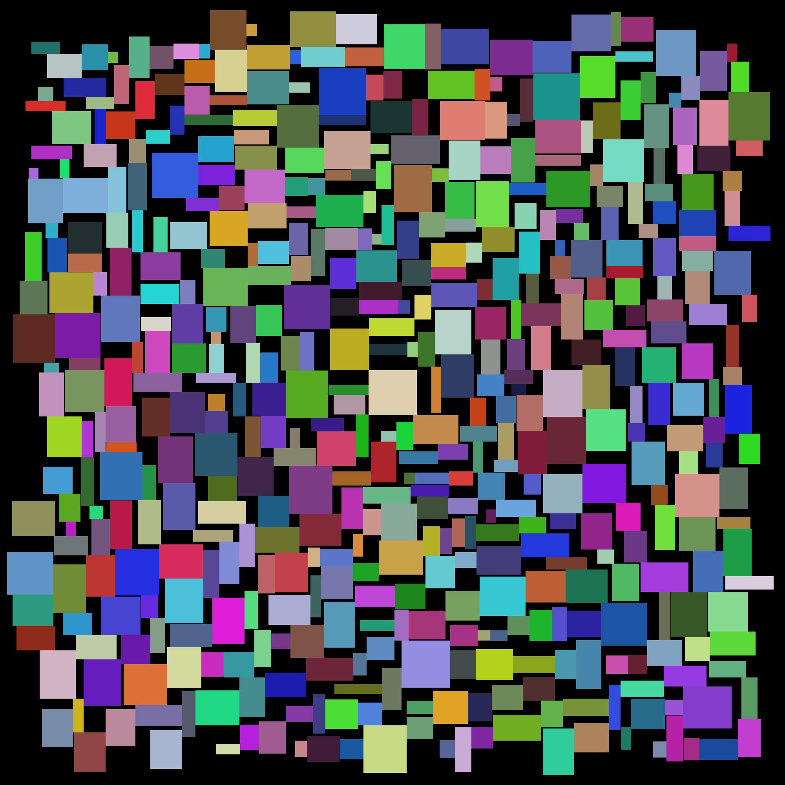
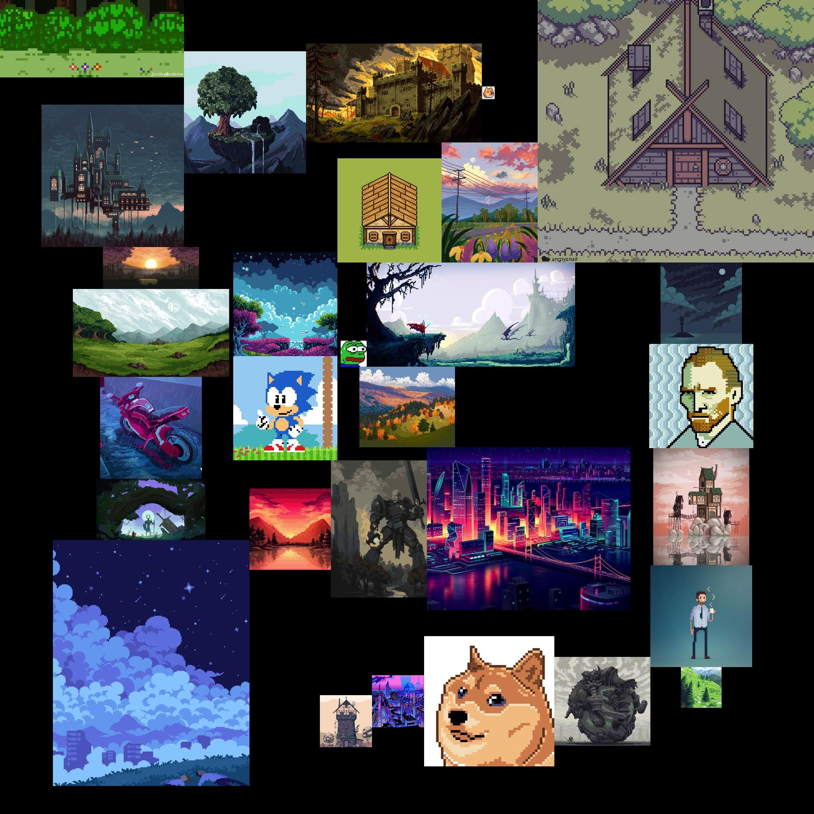

#CLOUD CIRCULAR LAYOUTER
Класс, способный плотно и без пересечений раскладывать прямоугольники вокруг одной точки

##Примеры работы программы

### Сотни квадратов с одинаковым размером 

### 500 случайных прямоуглольников со сторонами от 25 до 125 пикселей

### Взятые из открытого доступа Pixel Art изображения

