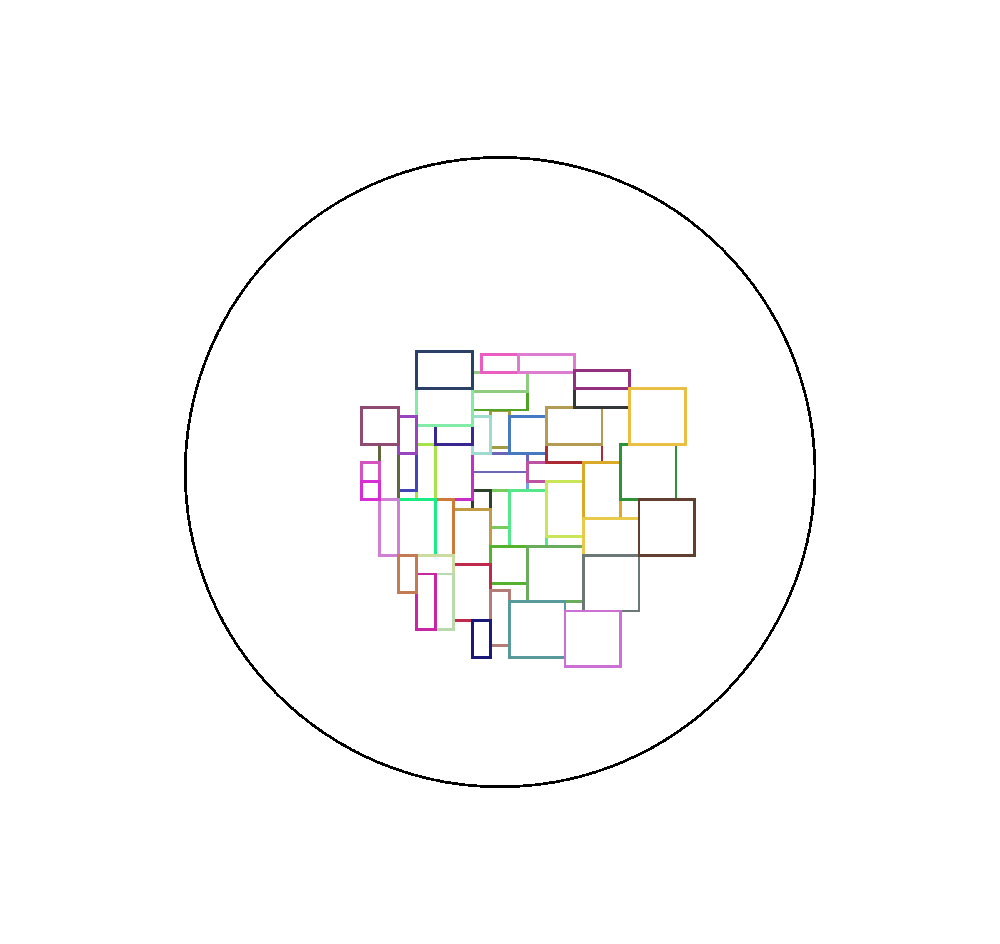
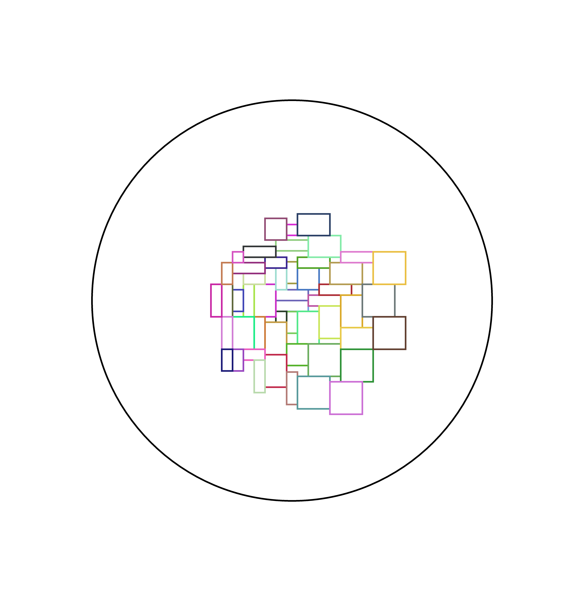
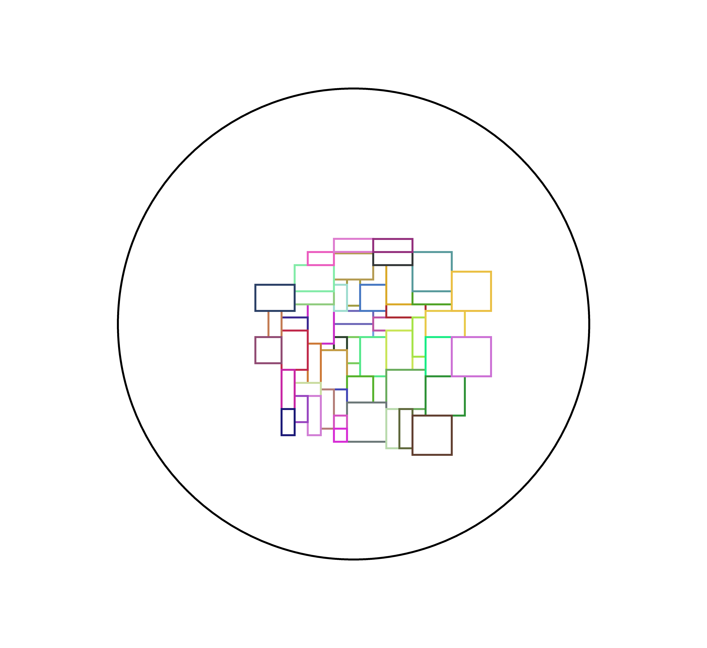

# Layout examples

> Rectangles' width and height are 100, 200 or 300

## Default parameters:

## ExtendRatio = 0.25, CurveStep = 0.01

### 50 rectangles

### 100 rectangles

## Custom parameters:

## ExtendRatio = 0.25, CurveStep = 0.5

### 50 rectangles

## ExtendRatio = 2.5, CurveStep = 0.01

### 50 rectangles

