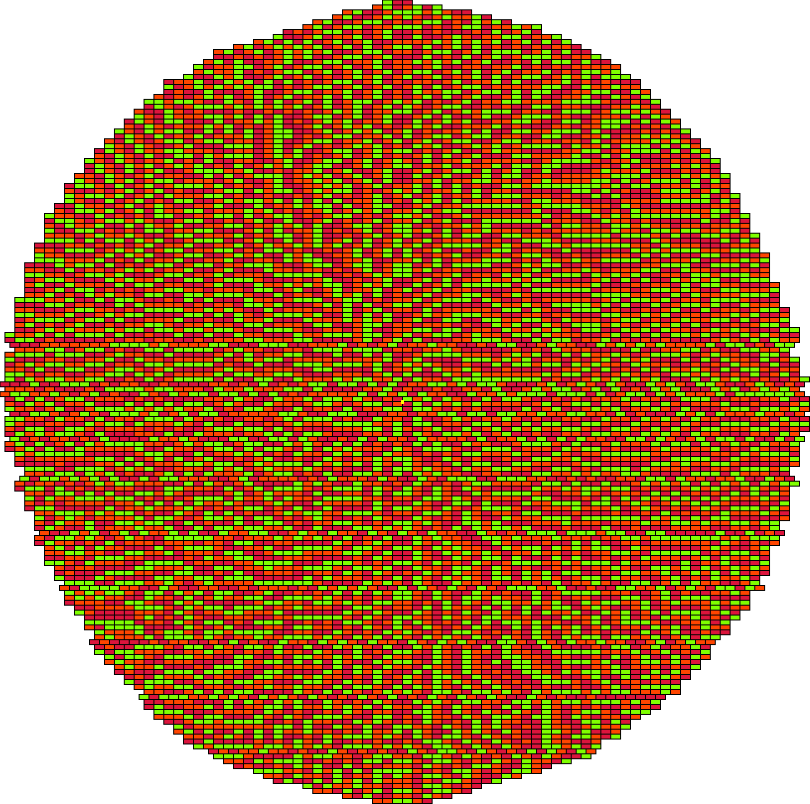
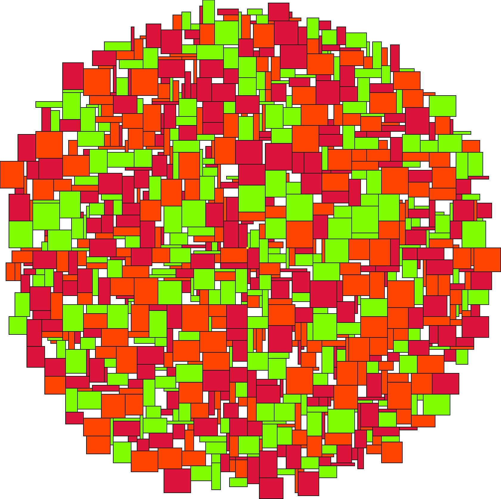
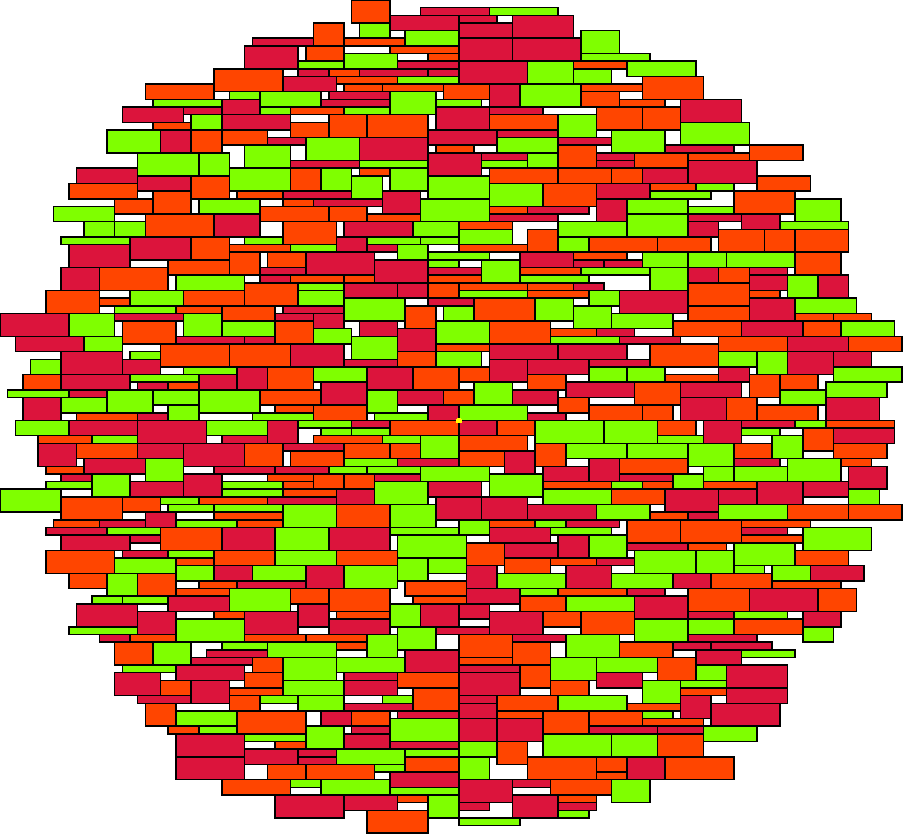
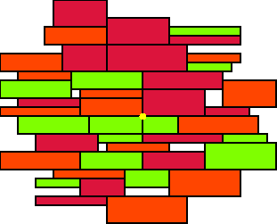
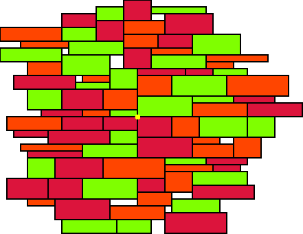
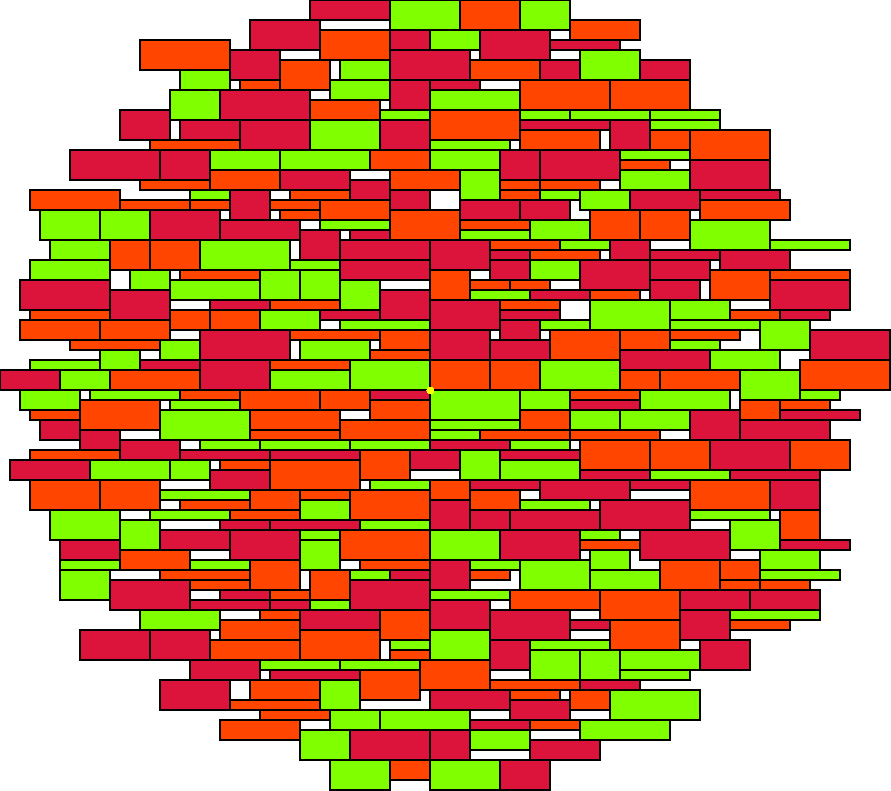

## Примеры работы алгоритма
### 10000 одинаковых прямоугольников

### 1000 случайных прямоугольников случайной формы

### 1000 случайных прямоугольников подходящей под слово формы

### 50, 100, 500 случайных прямоугольников подходящей под слово формы

