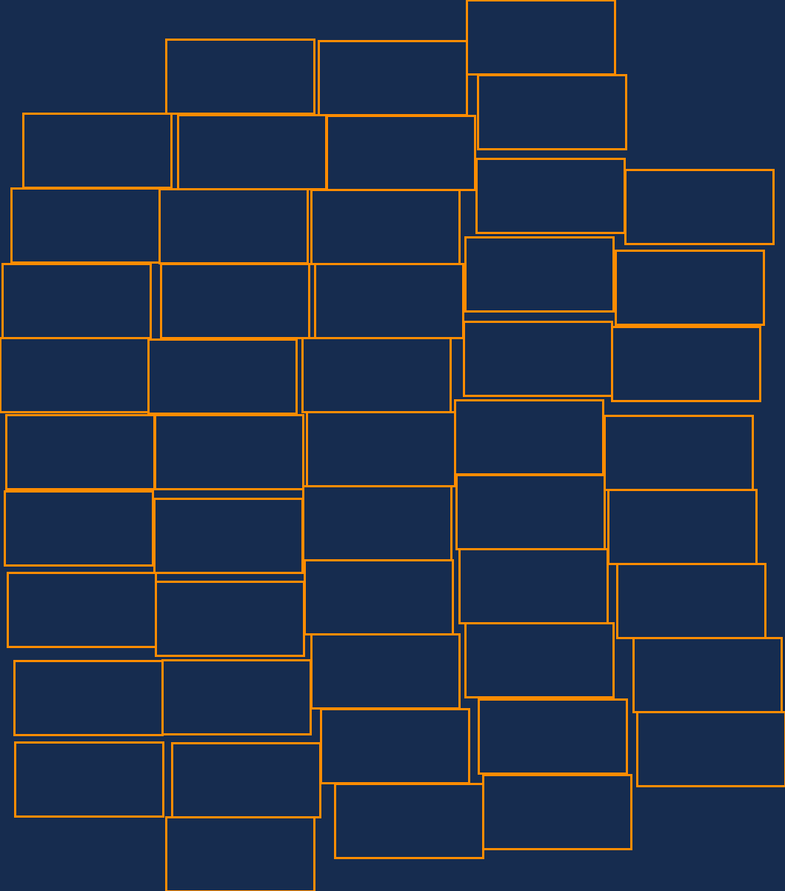
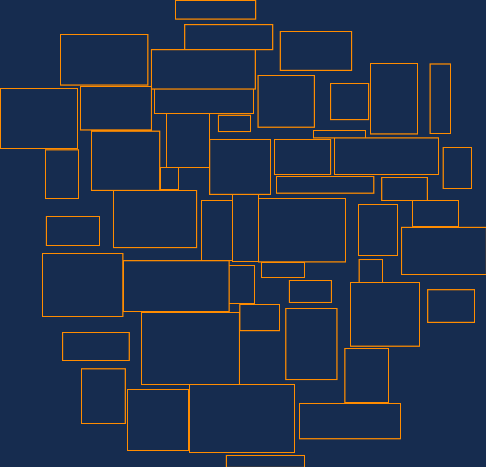



    ##Tags cloud visualization

    CircularCloudLayouter class makes up a cloud of rectangles. The form of the cloud is close to the circre and rectangles do not intersect each other.

    ###Visualization examples

    50 rectangles with the same size 200 x 100

<pre style="margin: 0px 0px 1em; padding: 5px; border: 0px; font-style: normal; font-variant-ligatures: normal; font-variant-caps: normal; font-variant-numeric: inherit; font-variant-east-asian: inherit; font-weight: 400; font-stretch: inherit; line-height: inherit; font-family: Consolas, Menlo, Monaco, &quot;Lucida Console&quot;, &quot;Liberation Mono&quot;, &quot;DejaVu Sans Mono&quot;, &quot;Bitstream Vera Sans Mono&quot;, &quot;Courier New&quot;, monospace, sans-serif; font-size: 13px; vertical-align: baseline; box-sizing: inherit; width: auto; max-height: 600px; overflow: auto; background-color: rgb(239, 240, 241); overflow-wrap: normal; color: rgb(36, 39, 41); letter-spacing: normal; orphans: 2; text-align: left; text-indent: 0px; text-transform: none; widows: 2; word-spacing: 0px; -webkit-text-stroke-width: 0px; text-decoration-style: initial; text-decoration-color: initial;"><code style="margin: 0px; padding: 0px; border: 0px; font-style: inherit; font-variant: inherit; font-weight: inherit; font-stretch: inherit; line-height: inherit; font-family: Consolas, Menlo, Monaco, &quot;Lucida Console&quot;, &quot;Liberation Mono&quot;, &quot;DejaVu Sans Mono&quot;, &quot;Bitstream Vera Sans Mono&quot;, &quot;Courier New&quot;, monospace, sans-serif; font-size: 13px; vertical-align: baseline; box-sizing: inherit; background-color: rgb(239, 240, 241); white-space: inherit;"></code></pre>

    50 rectangles with random sizes between 50 x 20 and 300 x 200

<pre style="margin: 0px 0px 1em; padding: 5px; border: 0px; font-style: normal; font-variant-ligatures: normal; font-variant-caps: normal; font-variant-numeric: inherit; font-variant-east-asian: inherit; font-weight: 400; font-stretch: inherit; line-height: inherit; font-family: Consolas, Menlo, Monaco, &quot;Lucida Console&quot;, &quot;Liberation Mono&quot;, &quot;DejaVu Sans Mono&quot;, &quot;Bitstream Vera Sans Mono&quot;, &quot;Courier New&quot;, monospace, sans-serif; font-size: 13px; vertical-align: baseline; box-sizing: inherit; width: auto; max-height: 600px; overflow: auto; background-color: rgb(239, 240, 241); overflow-wrap: normal; color: rgb(36, 39, 41); letter-spacing: normal; orphans: 2; text-align: left; text-indent: 0px; text-transform: none; widows: 2; word-spacing: 0px; -webkit-text-stroke-width: 0px; text-decoration-style: initial; text-decoration-color: initial;"><code style="margin: 0px; padding: 0px; border: 0px; font-style: inherit; font-variant: inherit; font-weight: inherit; font-stretch: inherit; line-height: inherit; font-family: Consolas, Menlo, Monaco, &quot;Lucida Console&quot;, &quot;Liberation Mono&quot;, &quot;DejaVu Sans Mono&quot;, &quot;Bitstream Vera Sans Mono&quot;, &quot;Courier New&quot;, monospace, sans-serif; font-size: 13px; vertical-align: baseline; box-sizing: inherit; background-color: rgb(239, 240, 241); white-space: inherit;"></code></pre>

    &nbsp;

