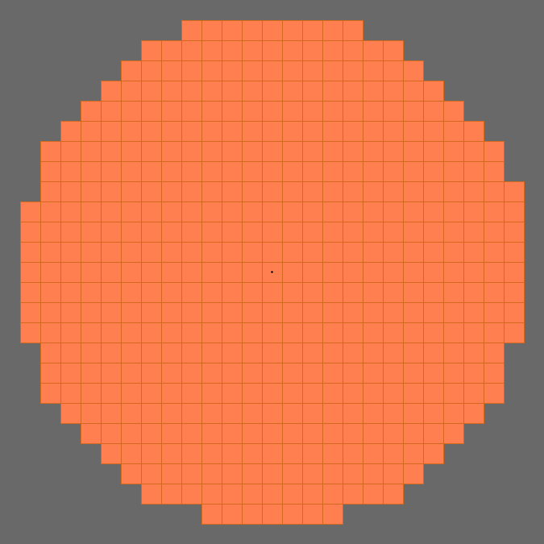

# Демонстрация работы алгоритма 
Расположение 100 случайно сгенерированных непересекающихся прямоугольников, 
размерами от (1,1) до (100,100):

Выполнение условия плотности упаковки и формирования круга: 500 прямоугольников 
с размерами (25,25):

