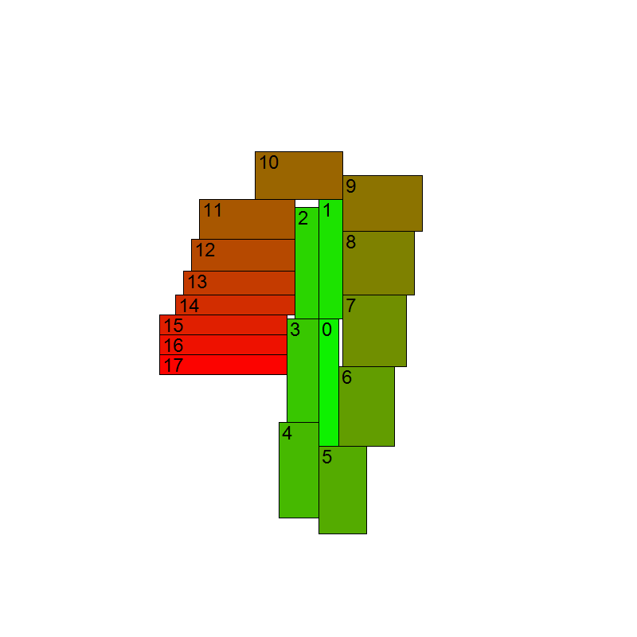
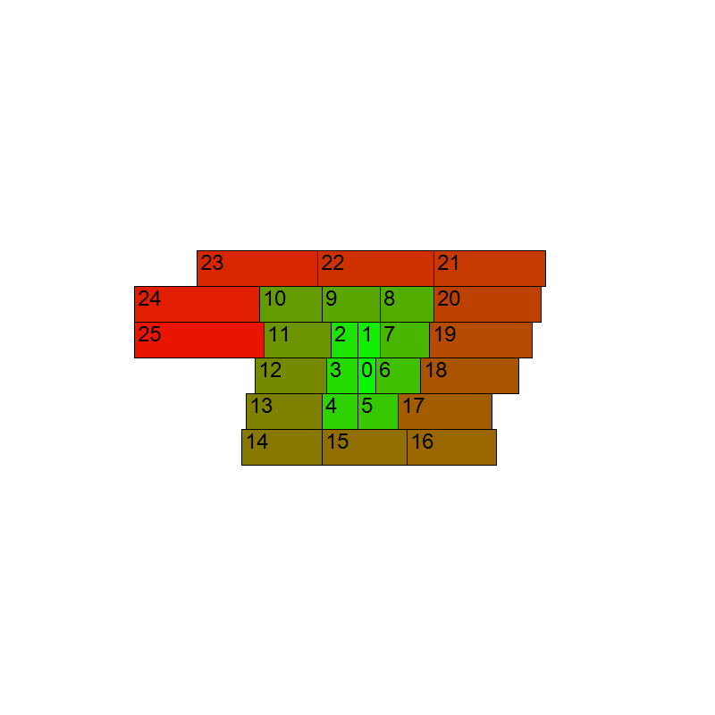
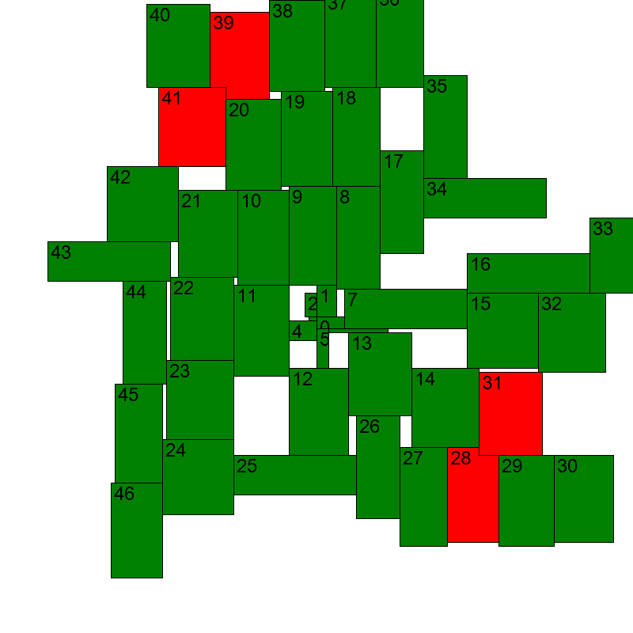
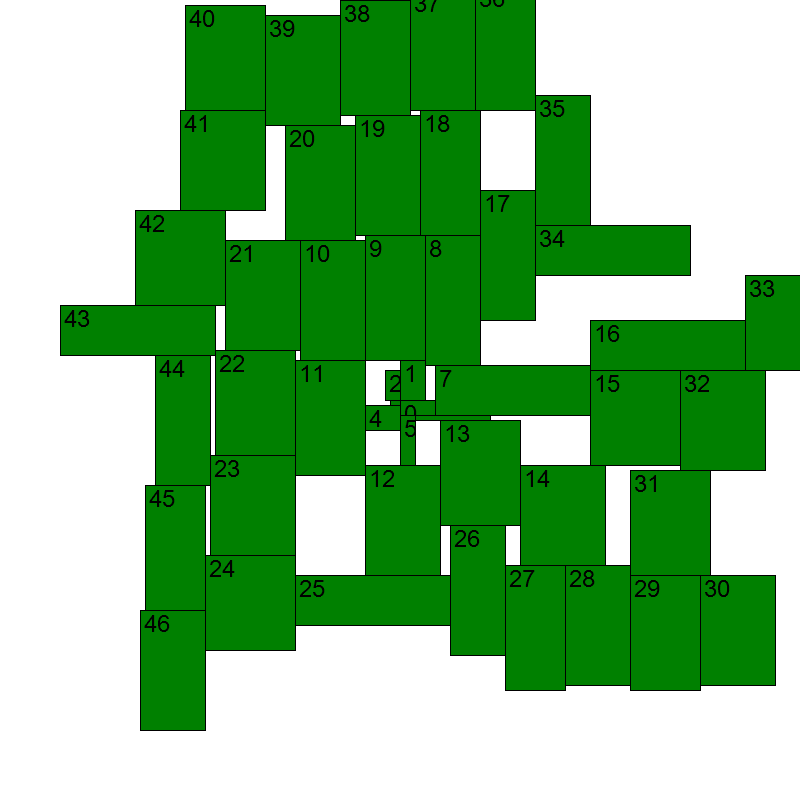

# Примеры сгенерированных изображений
## 18 прямоугольников
---

## 26 горизонтальных прямоугольников
---

## Пересечения (провал)
Так выглядело изображение, генерируемое тестом NotHaveIntersections_WithALotRectangles
в случае провала до того, как я исправил баг
---

## Пересечения (успех)
А так в случае успеха после того, как я исправил баг
(сейчас тест не генерирует изображение в случае успеха)
---
